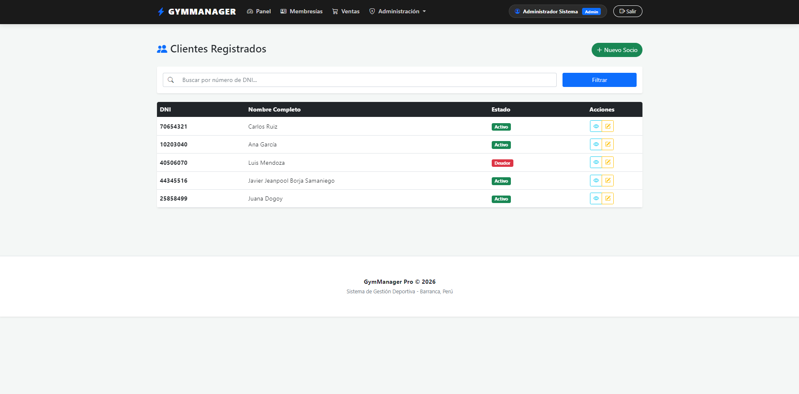
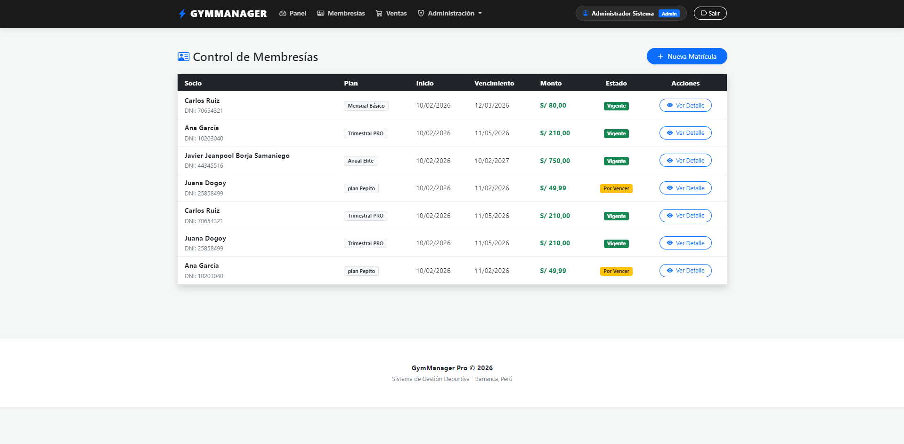
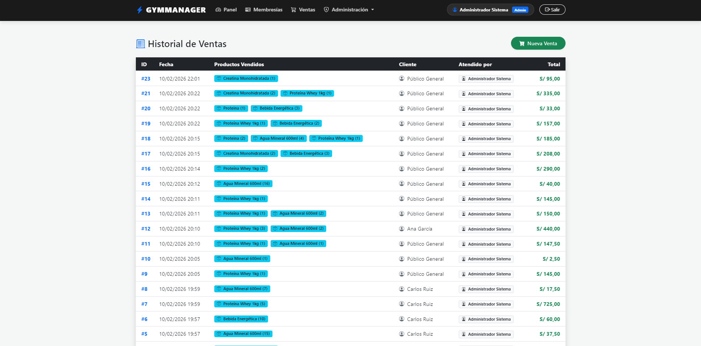
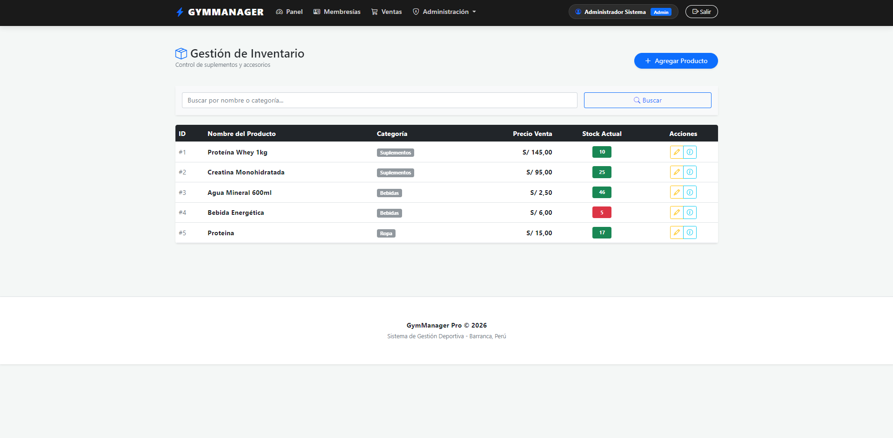
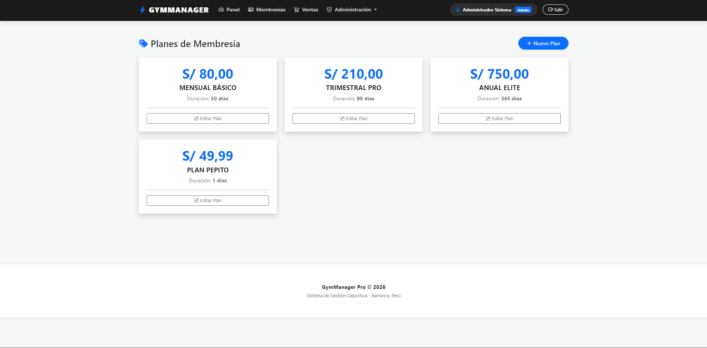
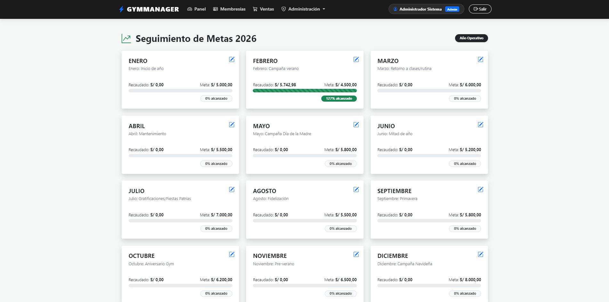
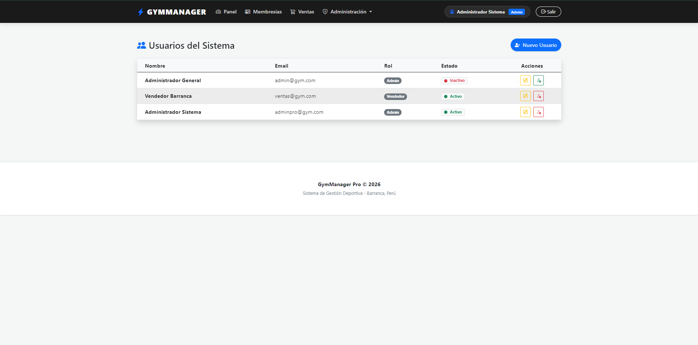
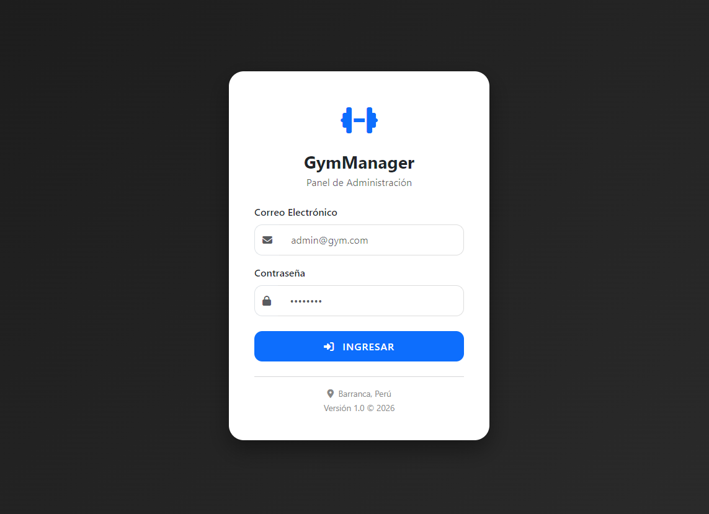

💪 GymManager Sistema completo de gestión para gimnasios con control de membresías, ventas y administración de clientes.
<div align="center">


</div>
---

## ✨ Características Principales

- 👥 **Gestión de Clientes** - Registro y administración completa
- 💳 **Membresías** - Control de planes y renovaciones
- 🛒 **Ventas** - Sistema de carrito para productos
- 📊 **Reportes** - Seguimiento de ingresos mensuales
- 🔐 **Roles** - Sistema de permisos (Admin, Vendedor, Cliente)
- 📱 **Dashboard** - Panel con métricas en tiempo real

---

## 📸 Vista del Sistema

<div align="center">

### 🏠 Dashboard Principal


### 👥 Gestión de Clientes


### 📝 Matrículas y Contratos


### 🛒 Carrito de Ventas


### 📦 Inventario de Productos


### 💳 Planes y Membresías


### 📊 Metas Mensuales


### 👤 Gestión de Usuarios


### 🔐 Control de Acceso


</div>

---

## 🏗️ Arquitectura

Patrón **MVC (Model-View-Controller)** con:
```
📦 GymManager.Web
 ┣ 📂 Controllers/      → Lógica de control
 ┣ 📂 Models/           → Modelos de datos
 ┣ 📂 Views/            → Vistas Razor
 ┣ 📂 Data/             → Contexto DB
 ┣ 📂 wwwroot/          → Archivos estáticos
 ┗ 📜 script.sql        → Scripts SQL
```

**Patrones aplicados:** Repository, Dependency Injection, Stored Procedures

---

## 🔐 Sistema de Roles

| Rol | Permisos |
|-----|----------|
| **👑 Administrador** | Control total del sistema |
| **🛍️ Vendedor** | Ventas y atención al cliente |

---

## 🛠️ Tecnologías

**Backend:**
- ASP.NET Core MVC
- C# + Entity Framework Core
- SQL Server + Stored Procedures

**Frontend:**
- HTML5 / CSS3 / JavaScript
- Bootstrap 5
- Razor Pages

---

## 🚀 Instalación

### 1. Clonar el Repositorio
```bash
git clone https://github.com/javierborja09/GymManager.git
cd GymManager.Web
```

### 2. Configurar Base de Datos

**Ejecutar script SQL:**
1. Abrir SQL Server Management Studio
2. Conectarse a tu instancia
3. Abrir y ejecutar `script.sql`

**Configurar conexión en `appsettings.json`:**
```json
{
  "ConnectionStrings": {
    "DefaultConnection": "Server=localhost;Database=GymManagerDB;Trusted_Connection=True;TrustServerCertificate=True;"
  }
}
```

**Configuraciones alternativas:**
```json
// SQL Server Express
"Server=localhost\\SQLEXPRESS;Database=GymManagerDB;Trusted_Connection=True;TrustServerCertificate=True;"

// Con usuario/contraseña
"Server=localhost;Database=GymManagerDB;User Id=usuario;Password=contraseña;TrustServerCertificate=True;"
```

### 3. Ejecutar
```bash
# Compilar
dotnet build

# Ejecutar
dotnet run
```

O presiona **F5** en Visual Studio.

---

## 🧪 Usuarios de Prueba

| Usuario | Contraseña | Rol |
|---------|-----------|-----|
| admin@gym.com | 123456 | Administrador |
| vendedor@gym.com | 123456 | Vendedor |

---

## 📝 Próximas Características

- [ ] Aplicación móvil
- [ ] Notificaciones push
- [ ] Sistema de reserva de clases
- [ ] Código QR para check-in
- [ ] API REST

---

## 📄 Licencia

MIT License - Ver archivo `LICENSE`

---

## 📫 Contacto

[](https://github.com/Javierborja09)
[](https://www.linkedin.com/in/javier-jeanpool-borja-samaniego-a6b8b7300/)

---

<div align="center">

**⭐ Si te fue útil, dale una estrella en GitHub ⭐**

Desarrollado con ❤️ para la comunidad fitness

</div>